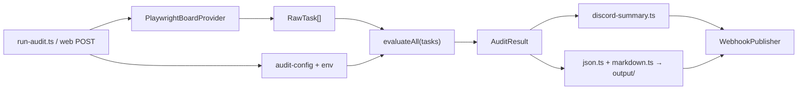

# AppTask Auditor — план реализации MVP

Источник: [AGENTS.md](./AGENTS.md), ТЗ на 17 проверок карточки.

**Текущий фокус:** navigation smoke test + стабильный parser. **Rule engine — после** стабильного collect.

---

## 1. File tree

```
apptask-auditor/
├── AGENTS.md
├── PLAN.md
├── README.md
├── package.json
├── tsconfig.json
├── playwright.config.ts
├── .env.example
├── .gitignore
│
├── app/src/
│   ├── config/
│   │   ├── audit-config.ts       # пороги, blacklist, requiredTags, rule severity overrides
│   │   └── env.ts                # APPTASK_AUTH_STATE, DISCORD_WEBHOOK_URL, BOARD_URL, PROJECT_NAME
│   │
│   ├── adapters/apptask/
│   │   ├── types.ts              # BoardProvider, RawTask (минимальная модель)
│   │   ├── auth.ts               # путь к storageState, проверка сессии
│   │   ├── board.ts              # PlaywrightBoardProvider: список card refs / URLs
│   │   ├── card.ts               # parseCard(page) → RawTask, без правил
│   │   └── selectors.ts          # [DOM-TBD] locators после codegen
│   │
│   ├── adapters/discord/
│   │   ├── publisher.ts          # interface ReportPublisher
│   │   ├── webhook.ts            # MVP: summary text + file attach
│   │   └── bot-adapter.ts        # stub
│   │
│   ├── rules/
│   │   ├── rule-types.ts         # Rule, RuleResult, RuleContext, AuditResult
│   │   ├── registry.ts           # список всех rule fn по id
│   │   ├── hard-rules.ts
│   │   └── soft-rules.ts
│   │
│   ├── reports/
│   │   ├── build-audit-result.ts # агрегация topIssues, счётчики
│   │   ├── json.ts
│   │   ├── markdown.ts
│   │   └── discord-summary.ts
│   │
│   ├── app/
│   │   └── run-audit.ts          # CLI оркестратор
│   │
│   └── web/                      # optional
│       ├── server.ts
│       └── pages/index.html      # board URL + webhook + Run
│
├── tests/
│   ├── rules/                    # unit, fixtures only
│   ├── fixtures/
│   │   └── board-sample.json     # снято с реальной доски
│   └── e2e/
│       ├── auth-navigation.spec.ts
│       └── scrape-smoke.spec.ts
│
├── playwright/.auth/             # gitignored
└── output/                       # gitignored, audit-{ts}/
```

---

## 2. Data flow



| Этап | Вход | Выход | Файл |
|------|------|-------|------|
| Collect | `boardUrl`, `storageState` | `RawTask[]` | `board.ts`, `card.ts` |
| Evaluate | `RawTask[]`, `auditConfig` | `AuditResult` | `registry.ts`, `hard/soft-rules.ts` |
| Format detail | `AuditResult` | `.json`, `.md` | `reports/json.ts`, `markdown.ts` |
| Format summary | `AuditResult` | `string` + embed meta | `discord-summary.ts` |
| Publish | summary + files | 1–2 HTTP POST | `webhook.ts` |

---

## 3. Auth strategy

| Что | Как |
|-----|-----|
| Первичный логин | Ручной: `playwright codegen <apptask-url> --save-storage=playwright/.auth/user.json` |
| Прогоны | `playwright.config.ts` → `storageState: playwright/.auth/user.json` |
| Проверка | `auth.ts`: открыть board URL; если редирект на login → fail fast с понятной ошибкой |
| Секреты | `.auth/` в `.gitignore`; учётные данные не в репо |
| CI / сервер | Документировать обновление state; MVP — локальный запуск |

**Не делать в MVP:** автоматический login по паролю в CI (пока нет требования и 2FA неизвестна).

---

## 4. DOM extraction strategy

### Подтверждено вручную (AppTask UI)

| Факт | Значение |
|------|----------|
| Пример board URL | `https://apptask.ru/c/7/board/445` |
| Карточки | внутри **раскрываемых категорий** — категории нужно раскрыть до сбора |
| Открытие карточки | **модальное окно** поверх доски |
| URL карточки | `/board/445/{taskId}` (меняется при открытии) |
| taskId | из URL или заголовок «№ …» |
| Состояние карточки | может быть пустой или заполненной |
| Расположение полей | правая панель + основная область модалки |
| Режим | **только чтение DOM**, не редактировать карточки |

**Locators:** уточнять через codegen → `selectors.ts`. До стабилизации — navigation smoke test обязателен.

### Модель `RawTask` (поля для парсера)

Все поля: `null` / `[]` если пусто. Парсер не падает на пустой карточке.

| Поле | UI | Locator label |
|------|-----|---------------|
| `id` / number | URL или «№ …» | подтверждено |
| `url` | текущий page URL в модалке | подтверждено |
| `title` | заголовок | подтверждено |
| `descriptionText` | основная область | подтверждено |
| `createdAt` | поле | label TBD |
| `startDate` | поле | label TBD |
| `dueDate` | поле | label TBD |
| `priority` | правая панель | label TBD |
| `status` | поле | label TBD |
| `tags` | поле | label TBD |
| `creator` | поле | label TBD |
| `assignees` | поле | label TBD |
| `category` | категория на доске / в карточке | label TBD |
| `stage` | поле | label TBD |
| `actualTime` | поле | label TBD |
| `plannedTime` | поле | label TBD |
| `links` | ссылки в описании/полях | подтверждено |
| `attachments` | вложения | подтверждено |

`taskType` для правил ТЗ — из `category` / `tags` / отдельного поля после mapping в rule engine (не в парсере).

### Board scrape (`board.ts`) — после green navigation test

1. `goto(boardUrl)` + auth.  
2. `expandAllCategories(page)`.  
3. Собрать handles карточек в раскрытых категориях.  
4. Для каждой: open modal → `parseCard` → close modal (Escape / кнопка закрытия).  
5. **Не** сохранять/редактировать поля.

### Card parse (`card.ts`) — после green navigation test

- Scope: `page.getByRole('dialog')` (модалка).  
- Только `.textContent()` / read-only locators.  
- Пустое → `null` / `[]`.

### Failure handling

- `trace: retain-on-failure`, `screenshot: only-on-failure`.  
- Лог: `cardIndex`, `cardUrl`, step `open|parse|close`.

---

## 5. Rule engine design

### Типы (`rule-types.ts`)

```ts
RuleResult = { ruleId, status: "PASS"|"FAIL"|"WARN", reason }
RuleContext = { config, allTasks: RawTask[] }
Rule = { id, defaultSeverity: "hard"|"soft", evaluate(task, ctx): RuleResult }
```

- `evaluateAll(tasks)` → `AuditResult { meta, topIssues[], cards: { task, results[] } }`.  
- Стабильные `ruleId` (например `deadline_present`, `title_generic`).  
- Unit-тесты: fixture JSON → ожидаемые статусы; **без браузера**.

### 17 правил ТЗ → ruleId + nature

| # | ТЗ | ruleId | Severity | Nature |
|---|-----|--------|----------|--------|
| 1 | Название понятное / есть | `title_present` | hard | **deterministic** (non-empty) |
| 2 | Не общее название | `title_not_generic` | soft | **heuristic** (config blacklist, optional min length) |
| 3 | Подробное описание | `description_present` | hard | **deterministic** (min length threshold in config) |
| 4 | Цель / ожидаемый результат | `description_has_goal` | soft | **heuristic** (keyword list in config) |
| 5 | Исполнитель | `assignee_present` | hard | **deterministic** |
| 6 | Дедлайн есть | `deadline_present` | hard | **deterministic** |
| 7 | Дедлайн не просрочен | `deadline_not_overdue` | hard | **deterministic** (if `dueDate` parsed) |
| 8 | Дедлайн реалистичен | `deadline_not_in_past` | hard | **deterministic** (overlap с 7; отдельно если «в прошлом» при создании — same check if only dueDate) |
| 9 | Приоритет | `priority_present` | hard | **deterministic** |
| 10 | Нужные теги | `tags_required` | soft/hard | **deterministic** if `requiredTags` non-empty in config |
| 11 | Тип задачи из списка | `task_type_valid` | hard | **deterministic** if `taskType` extracted; else SKIP/WARN «field not found» |
| 12 | Этап ↔ состояние | `stage_matches_column` | soft | **heuristic** (config map `column → expectedStage`; until DOM confirms `stage`) |
| 13 | Оценка / бюджет | `estimate_present` | soft | **deterministic** if `plannedTime` mapped |
| 14 | Связь со сметой/договором | `estimate_link_present` | soft | **heuristic** (URL regex patterns in config) |
| 15 | Ссылки на артефакты | `artifact_links_present` | soft | **heuristic** (config patterns or «any external link») |
| 16 | Ссылки/вложения открываются | `links_reachable` | hard | **deterministic** (HTTP HEAD/GET, timeout); attachments without URL → WARN |
| 17 | Не дубликат | `not_duplicate` | soft | **heuristic** (normalized title similarity vs other cards on board) |

**Файлы:** `hard-rules.ts` (1,3,5–9,11,16), `soft-rules.ts` (остальные). Severity overridable в `audit-config.ts`.

---

## 6. Discord publishing design

| Компонент | Файл | Поведение |
|-----------|------|-----------|
| `ReportPublisher` | `publisher.ts` | `publish(summary, artifacts[])` |
| MVP | `webhook.ts` | POST #1: plain text summary; POST #2: multipart `audit.json` (+ optional `.md`) |
| Stub | `bot-adapter.ts` | no-op или throw «not implemented» |

**Summary text** (`discord-summary.ts`): шаблон из AGENTS.md — project, count, FAIL, WARN, top 5–7 `topIssues`, «файл приложен».

**Не делать:** пост по карточке; >2 сообщений без необходимости.

**Env:** `DISCORD_WEBHOOK_URL` (secret, `.env`).

---

## 7. Minimal web UI design

**Optional MVP** — один экран, без БД.

| Файл | Назначение |
|------|------------|
| `web/server.ts` | Express/Fastify, `POST /audit` |
| `web/pages/index.html` | 2 input: Board URL, Discord webhook; button Run |

Flow: form → server вызывает тот же `run-audit.ts` → ответ: path к `output/` + copy summary text.

**Не в MVP:** сохранение проектов, история, auth в UI.

---

## 8. Risk list

| Risk | Impact | Mitigation |
|------|--------|------------|
| DOM AppTask нестабилен | scraper ломается | codegen locators; trace; fixtures |
| Поля «тип», «этап», «смета» не видны в UI | правила 11–14 дают false positives | DOM-TBD → WARN + reason; не выдумывать поля |
| Даты в локали RU | overdue ложный | единый parser; тест на fixture |
| `links_reachable` медленный / 429 | долгий прогон | concurrency limit, timeout, skip internal apptask URLs |
| Discord rate limit | не доставлен отчёт | ≤2 messages; retry once |
| Auth expires | прогон падает | явная ошибка «re-run codegen» |
| Дубликаты | ложные WARN | высокий порог similarity; только same board |
| Субъективные правила | спор на ревью | WARN by default; всё в `audit-config.ts` |

---

## 9. Incremental implementation order

| # | Deliverable | Files | Gate |
|---|-------------|-------|------|
| 0 | Repo skeleton | `package.json`, `playwright.config.ts`, `.gitignore`, `types.ts` | `npm test` runs |
| 1 | **Navigation smoke** | `navigation.ts`, `selectors.ts`, `navigation-smoke.spec.ts` | board → expand categories → open card → modal + URL |
| 2 | Parser | `card.ts`, `board.ts`, `board-sample.json` | fixture ≥3 cards; read-only |
| 3 | Rule engine | `rules/*`, `tests/rules/*` | **только после green шаг 1–2** |
| 4 | Reports | `build-audit-result.ts`, `json.ts`, `markdown.ts`, `discord-summary.ts` | sample files in `output/` |
| 5 | Discord + CLI | `webhook.ts`, `run-audit.ts` | end-to-end: board → Discord + files |
| 6 | Debug polish | `playwright.config.ts` trace/screenshot, README «If it fails» | — |
| 7 | Web (optional) | `web/server.ts`, `index.html` | form triggers same pipeline |

**Правило перехода:** шаг N+1 не начинается, пока не пройден gate шага N.

---

## Out of scope (явно)

- AppTask API adapter  
- DB / run history / cron / multi-project  
- Full Discord bot (non-webhook)  
- Поля AppTask не из таблицы §4  
