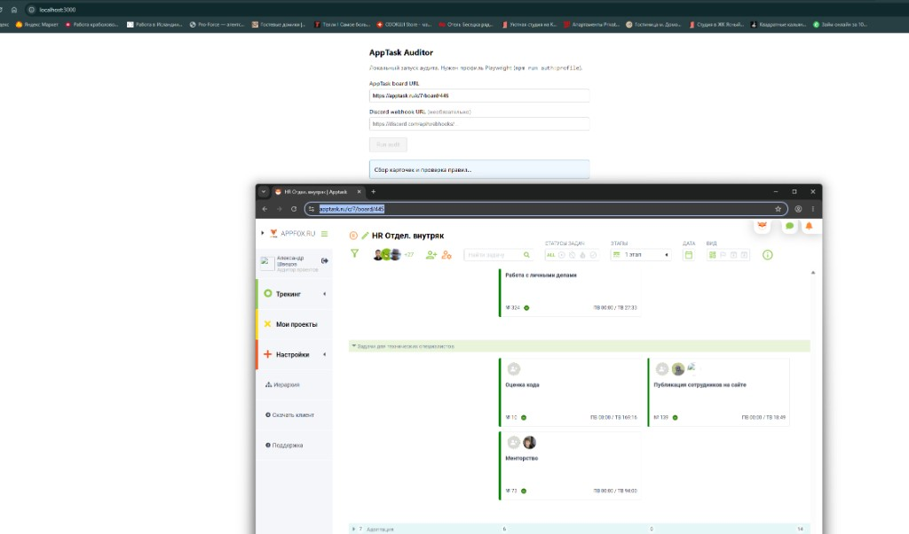
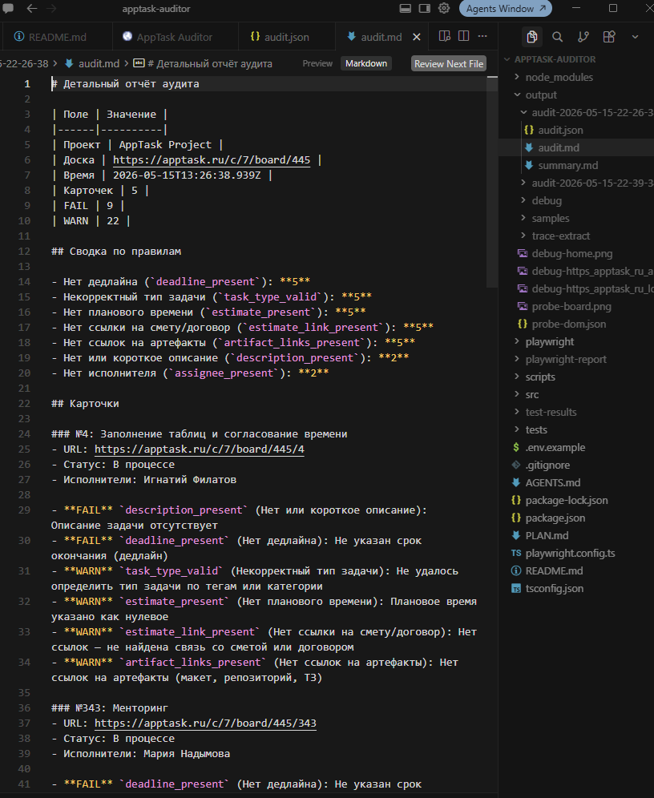
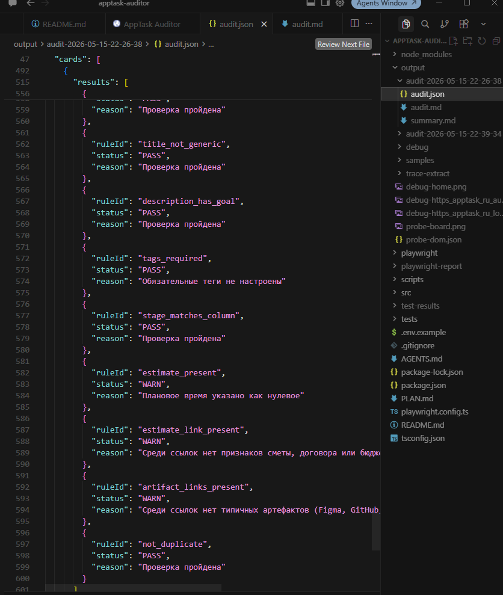

# AppTask Project Auditor

Локальный аудитор карточек AppTask: Playwright собирает данные с доски, rule engine проверяет качество, отчёты сохраняются в `output/` и опционально уходят в Discord.

## Быстрый старт

```bash
npm install
npx playwright install chromium
cp .env.example .env
npm run auth:profile
```

### Новый компьютер (production: Discord-бот + DB)

Секреты **не в git**. После `git clone` / `git pull`:

1. Скопируйте `.env` с рабочего ПК в папку проекта.
2. Запустите `.\setup-machine.bat` (npm install, watchdog, автозапуск).
3. Проверка: `npm run setup:check`.

Подробно: **[docs/NEW_MACHINE_SETUP.md](./docs/NEW_MACHINE_SETUP.md)**.

## Как залогиниться

Сессия хранится в **persistent-профиле Chromium** (не в git):

`playwright/.user-data/apptask`

### Первый вход

```bash
npm run auth:profile
```

1. Откроется окно браузера на https://apptask.ru/login  
2. Войдите вручную (при капче — пройдите в том же окне)  
3. В терминале нажмите **Enter** — профиль сохранится  

### Проверка, что вход работает

```bash
npm run board:headed
```

Должны появиться колонки: «Новая задача», «В процессе», «На проверке», «Завершено».

> Не запускайте два аудита одновременно (CLI + Web UI) — один профиль Chromium.

## Как запустить аудит

### CLI (рекомендуется)

```powershell
# все карточки на доске (долго на больших досках)
npm run audit

# ограничить число карточек
$env:APPTASK_AUDIT_MAX_CARDS="10"
npm run audit

# с URL доски и Discord webhook
npm run audit -- https://apptask.ru/c/7/board/445 https://discord.com/api/webhooks/...
```

После прогона:

```
output/audit-YYYY-MM-DD-HH-mm-ss/
  audit.json    — полный отчёт
  audit.md      — детальный markdown
  summary.md    — краткая сводка
```

### Web UI (локально)

```bash
npm run web
```

Откройте http://127.0.0.1:3000/ — введите URL доски и (опционально) Discord webhook, нажмите **Run audit**. Терминал с `npm run web` не закрывайте.



### Пример отчёта





## Переменные окружения

| Переменная | По умолчанию | Назначение |
|------------|--------------|------------|
| `APPTASK_BOARD_URL` | `https://apptask.ru/c/7/board/445` | URL доски для CLI / Web UI |
| `APPTASK_PROJECT_NAME` | `AppTask Project` | Имя проекта в отчётах |
| `APPTASK_USER_DATA_DIR` | `playwright/.user-data/apptask` | Папка persistent-профиля Chromium |
| `DISCORD_WEBHOOK_URL` | — | Webhook для summary + вложения `audit.json` |
| `APPTASK_AUDIT_MAX_CARDS` | `0` (все) | Лимит карточек за один прогон |
| `PORT` | `3000` | Порт Web UI |
| `HOST` | `127.0.0.1` | Адрес Web UI |

Скопируйте `.env.example` → `.env` и при необходимости отредактируйте.

## Что входит в MVP

| Слой | Статус |
|------|--------|
| **Auth** | Persistent profile (`auth:profile`), headed smoke |
| **Navigation** | Открытие доски, readiness по колонкам Kanban |
| **Parser** | Сбор refs, раскрытие категорий, парсинг модалки карточки → `RawTask` |
| **Rule engine** | 17 правил (hard → FAIL, soft → WARN), unit-тесты без браузера |
| **Reports** | `audit.json`, `audit.md`, `summary.md` в `output/audit-{timestamp}/` |
| **Discord** | Короткое summary + вложение JSON (≤2 сообщения, retry на 429) |
| **Web UI** | Форма: board URL + webhook, статус, ссылки на отчёт |
| **CLI** | `npm run audit` |

### Команды

| Команда | Описание |
|---------|----------|
| `npm run auth:profile` | Ручной логин → сохранить профиль |
| `npm run board:headed` | Smoke: доска + колонки |
| `npm run collect:sample` | Одна карточка → `output/samples/task-sample.json` |
| `npm run audit` | Полный прогон: collect → rules → reports → Discord |
| `npm run web` | Локальный Web UI |
| `npm run test:rules` | Unit-тесты правил |
| `npm run test:reports` | Unit-тесты отчётов |
| `npm run test:parse` | E2E парсера (нужен профиль) |
| `npm run setup:check` | Проверка .env, БД и Google Sheets (новый ПК) |
| `npm run typecheck` | Проверка TypeScript |

Подробности по правилам и архитектуре: [AGENTS.md](./AGENTS.md), [PLAN.md](./PLAN.md).

## Ограничения

- **Только Playwright**, без REST API AppTask (запланировано позже).
- **Только чтение DOM** — карточки на доске не редактируются.
- **Долгий прогон** — полная доска (100+ карточек) может занять более часа; используйте `APPTASK_AUDIT_MAX_CARDS`.
- **Один аудит за раз** — параллельные CLI/Web прогоны ломают профиль Chromium.
- **Даты** — разбор только формата `DD.MM.YYYY`.
- **Ссылки** — проверяется формат URL; HTTP-доступность ссылок по умолчанию выключена (`linkCheckEnabled: false` в конфиге).
- **Тип задачи** — эвристика по тегам/категории; при неясности — WARN, не FAIL.
- **Web UI** — без авторизации пользователей, без БД и истории; только локальный запуск.
- **Discord** — webhook вводится вручную; секреты не коммитить.

## Если что-то упало

```bash
npx playwright show-report
```

При ошибке парсера смотрите `output/debug/` (screenshot, HTML). При проблемах с профилем — закройте Chrome с `apptask` в user-data и снова `npm run auth:profile`.
